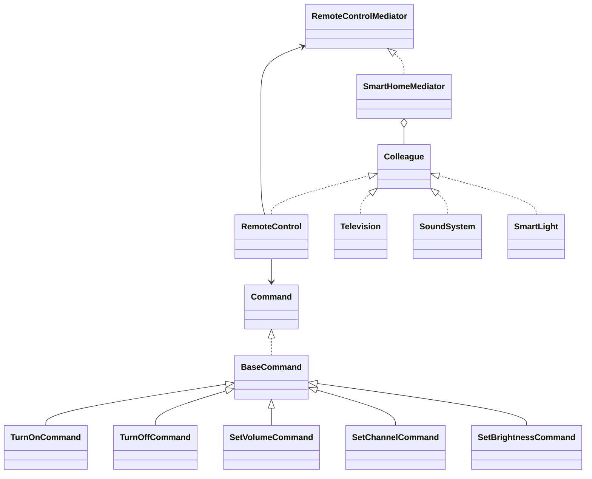

# 📺 Remote Control — Padrão Mediator

Projeto Java que simula um **sistema de controle remoto para dispositivos smart home**, implementando o **Padrão de Projeto Mediator (GoF)**.

---

## 🎯 Objetivo

Demonstrar na prática como o padrão **Mediator** desacopla objetos que precisam se comunicar, centralizando toda a lógica de roteamento em um único mediador — eliminando dependências diretas entre os dispositivos.

---

## 🧩 Padrão Mediator — Como foi aplicado

| Papel no Padrão | Classe no Projeto |
|---|---|
| `Mediator` (interface) | `RemoteControlMediator` |
| `ConcreteMediator` | `SmartHomeMediator` |
| `Colleague` (interface) | `Colleague` |
| `ConcreteColleague` emissor | `RemoteControl` |
| `ConcreteColleague` receptores | `Television`, `SoundSystem`, `SmartLight` |

> O `RemoteControl` **nunca se comunica diretamente** com `Television` ou qualquer outro dispositivo. Todo comando passa pelo `SmartHomeMediator`, que roteia para o dispositivo correto pelo nome registrado.

---

## 📁 Estrutura do Projeto

```
remote-control/
├── pom.xml
└── src/
    ├── main/java/com/remotecontrol/
    │   ├── RemoteControl.java                  # Controle remoto (emissor)
    │   ├── mediator/
    │   │   ├── RemoteControlMediator.java      # Interface do Mediador
    │   │   ├── SmartHomeMediator.java          # Mediador concreto
    │   │   └── Colleague.java                  # Interface dos dispositivos
    │   ├── commands/
    │   │   ├── Command.java                    # Interface de comando
    │   │   ├── BaseCommand.java                # Classe abstrata base
    │   │   ├── TurnOnCommand.java
    │   │   ├── TurnOffCommand.java
    │   │   ├── SetVolumeCommand.java
    │   │   ├── SetChannelCommand.java
    │   │   └── SetBrightnessCommand.java
    │   └── devices/
    │       ├── Television.java
    │       ├── SoundSystem.java
    │       └── SmartLight.java
    └── test/java/com/remotecontrol/
        ├── CommandTest.java                    # Testes unitários dos comandos
        ├── SmartHomeMediatorTest.java          # Testes do mediador
        ├── TelevisionTest.java                 # Testes da televisão
        ├── SoundSystemAndSmartLightTest.java   # Testes de som e luz
        └── RemoteControlIntegrationTest.java   # Testes de integração
```

---

## ⚙️ Tecnologias

- **Java 21**
- **JUnit 5** (Jupiter) — testes unitários e de integração
- **Maven** — gerenciamento de dependências e build

---

## 🚀 Como executar

### Pré-requisitos

- Java 21+
- Maven 3.8+

### Clonar e rodar

```bash
# Extraia o zip e entre na pasta
cd remote-control

# Compilar o projeto
mvn compile

# Executar todos os testes
mvn test

# Gerar relatório de testes
mvn surefire-report:report
```

---

## 🧪 Casos de Teste

O projeto possui **44 casos de teste** distribuídos em 5 classes:

### `CommandTest` — 10 testes
Valida a criação e consistência dos objetos de comando.

| Teste | Descrição |
|---|---|
| `turnOnCommandDeveEstarCorreto` | Verifica action, target e payload do TurnOnCommand |
| `turnOffCommandDeveEstarCorreto` | Verifica action e target do TurnOffCommand |
| `setVolumeCommandDeveArmazenarVolume` | Volume e payload corretos |
| `volumeZeroDeveSerValido` | Volume 0 é valor limite válido |
| `volumeMaximoDeveSerValido` | Volume 100 é valor limite válido |
| `setChannelCommandDeveArmazenarCanal` | Canal e payload corretos |
| `setBrightnessCommandDeveArmazenarBrilho` | Brilho e payload corretos |
| `baseCommandTargetNuloDeveLancarExcecao` | Target nulo lança `IllegalArgumentException` |
| `baseCommandTargetVazioDeveLancarExcecao` | Target vazio lança `IllegalArgumentException` |
| `toStringDeveConterCampos` | `toString()` contém target, action e payload |

---

### `SmartHomeMediatorTest` — 9 testes
Valida o comportamento central do mediador.

| Teste | Descrição |
|---|---|
| `deveRegistrarDispositivo` | Registra dispositivo com sucesso |
| `deveLancarExcecaoParaDispositivoNulo` | Dispositivo nulo lança exceção |
| `deveLancarExcecaoParaNomeVazio` | Nome vazio lança exceção |
| `hasDeviceDeveRetornarFalseParaNaoRegistrado` | Dispositivo não registrado retorna false |
| `deverodarComandoParaDispositivoCorreto` | Roteia comando apenas para o alvo correto |
| `deveRegistrarLogParaDispositivoInexistente` | Log registra erro para alvo inexistente |
| `deveLancarExcecaoComandoNulo` | Comando nulo lança `IllegalArgumentException` |
| `deveIgnorarAutoEnvio` | Dispositivo não pode enviar comando para si mesmo |
| `deveContarLogAposClear` | `clearLog()` limpa o histórico |

---

### `TelevisionTest` — 8 testes
Valida os comandos aplicados à televisão.

| Teste | Descrição |
|---|---|
| `tvDeveIniciarDesligada` | TV inicia desligada e liga com TurnOn |
| `tvDeveDesligar` | TurnOff desliga a TV |
| `tvDeveAlterarVolume` | SetVolume atualiza o volume |
| `tvDeveAlterarCanal` | SetChannel atualiza o canal |
| `tvDeveRegistrarComandosRecebidos` | Histórico de comandos registrado corretamente |
| `volumeInvalidoDeveLancarExcecao` | Volume < 0 ou > 100 lança exceção |
| `canalInvalidoDeveLancarExcecao` | Canal ≤ 0 lança exceção |
| `tvDeveManterVolumeDefault` | Volume padrão inicial é 20 |

---

### `SoundSystemAndSmartLightTest` — 9 testes
Valida SoundSystem e SmartLight individualmente.

| Teste | Descrição |
|---|---|
| `somDeveLigar` | SoundSystem liga com TurnOn |
| `somDeveDesligar` | SoundSystem desliga com TurnOff |
| `somDeveAjustarVolume` | SetVolume atualiza o volume |
| `somDeveIgnorarSetChannel` | SetChannel é recebido mas não altera estado |
| `luzDeveLigar` | SmartLight liga com TurnOn |
| `luzDeveDesligar` | SmartLight desliga com TurnOff |
| `luzDeveAjustarBrilho` | SetBrightness atualiza o brilho |
| `brilhoInvalidoDeveLancarExcecao` | Brilho < 0 ou > 100 lança exceção |
| `luzDeveIniciarBrilhoMaximo` | Brilho padrão inicial é 100 |

---

### `RemoteControlIntegrationTest` — 8 testes
Valida cenários completos com múltiplos dispositivos.

| Teste | Descrição |
|---|---|
| `controleSemMediadorDeveLancarExcecao` | Controle sem mediador lança `IllegalStateException` |
| `comandoDeveAfenarSomenteAlvo` | Comando não afeta dispositivos não-alvo |
| `cenarioHomeTheater` | Liga e configura TV, Som e Luz simultaneamente |
| `cenarioDesligarTudo` | Desliga todos os dispositivos em sequência |
| `multiplosAjustesDeVolumeDevemManterUltimo` | Último SetVolume prevalece |
| `logDeveConterEntradasParaCadaComando` | Log registra uma entrada por comando |
| `comandoParaInexistenteNaoDeveAfetar` | Dispositivo inexistente não afeta os demais |
| `doisControlesDevemFuncionar` | Dois controles remotos operam via mesmo mediador |

---

## 📐 Diagrama de Classes

O arquivo `diagrama-classes.mermaid` contém o diagrama completo do projeto.
Visualize em: [Mermaid Live Editor](https://mermaid.live)



---

## 💡 Exemplo de uso

```java
// 1. Criar o mediador
SmartHomeMediator mediator = new SmartHomeMediator();

// 2. Criar e registrar os dispositivos
RemoteControl remote = new RemoteControl("Controle");
Television tv        = new Television("TV");
SoundSystem som      = new SoundSystem("SOM");
SmartLight luz       = new SmartLight("LUZ");

mediator.registerDevice("Controle", remote);
mediator.registerDevice("TV", tv);
mediator.registerDevice("SOM", som);
mediator.registerDevice("LUZ", luz);

// 3. Enviar comandos — o mediador faz o roteamento
remote.sendCommand(new TurnOnCommand("TV"));
remote.sendCommand(new SetVolumeCommand("SOM", 60));
remote.sendCommand(new SetChannelCommand("TV", 13));
remote.sendCommand(new SetBrightnessCommand("LUZ", 30));

// 4. Verificar estado
System.out.println(tv.isOn());       // true
System.out.println(som.getVolume()); // 60
System.out.println(tv.getChannel()); // 13
System.out.println(luz.getBrightness()); // 30
```

---

## 📄 Licença

Projeto educacional — livre para uso e modificação.
